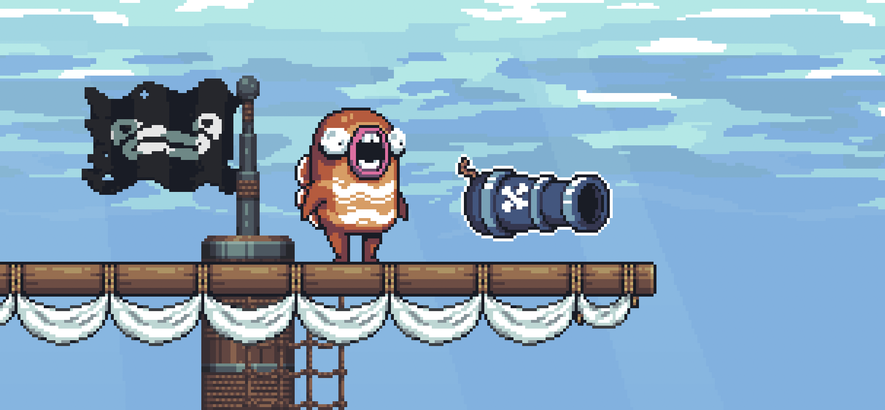
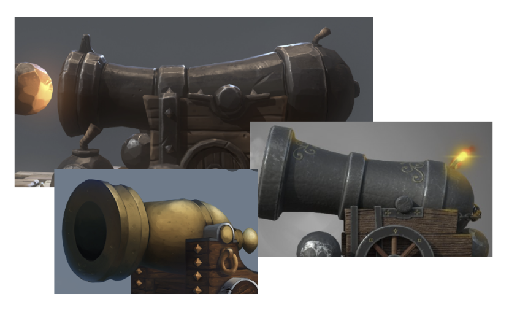
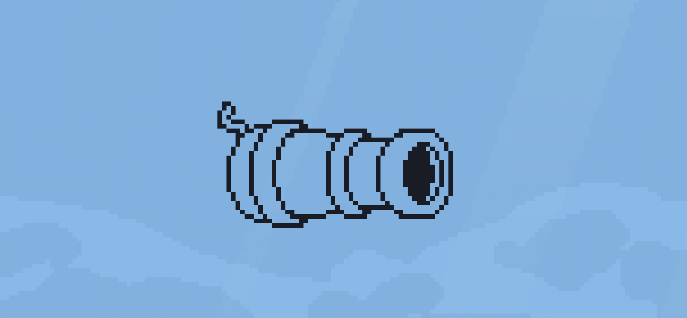
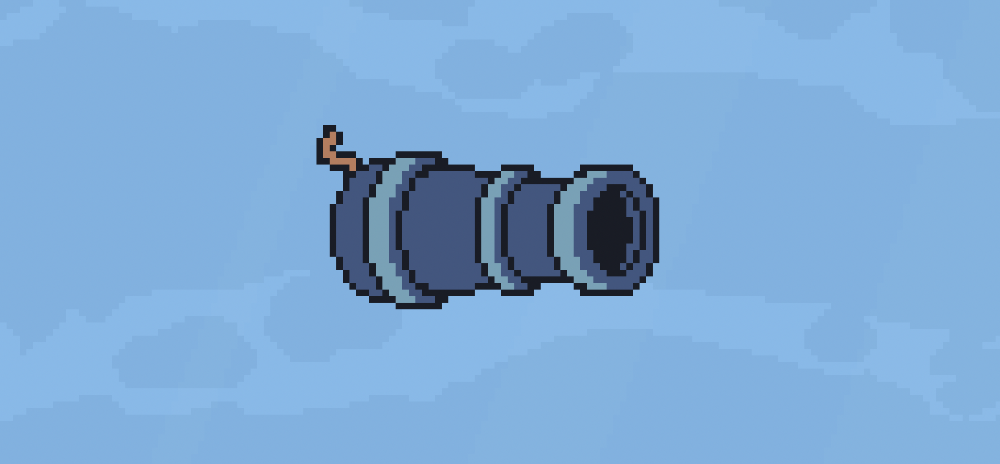
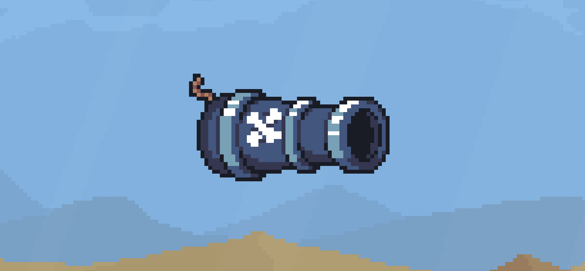

# Contributing Art

This guide will show you the steps to draw art using the Fish Fight style. Following these steps will help your custom art fit better in the Fish Fight world. For this example, we will focus on creating a cannon weapon, but these principles can be applied to other assets as well. If you are completely new to pixel art, make sure to take a look at the [Additional Resources](#additional-resources) section first.

## Concept

Before you start drawing, you need to have a clear idea of what it is you are creating. We recommend finding a few reference images that you can look at while creating your art. Even the best artists do this. Drawing something completely from memory tends to not give the best results. Below are some reference images we found for cannons.

## Outline

Now that you have some references, you can start drawing your art! To start off, draw an outline of the object's prominent features. Keep outlining more details until it is recognizable as the object you are creating. Below is the outline for the cannon weapon:

Here are the guidelines we use for outlining:

- All details for the object should be completely surrounded by outlines
- All outlines should be 1 pixel thick
- Outlines should use a dark color
- Generally, all outlines should be the same color
- Only non-solid materials like smoke, fire, etc. should be drawn without outlines
- If the object has holes, make them the same color as the outline

## Color

After you've finished outlining your object you are ready to begin coloring. Below is the cannon weapon after being colored:

Here are the guidelines we use for applying color:

- Use colors that have a similar saturation level with game's existing assets
- Use contrasting colors to distinguish different parts of the object
- The entire object should be filled with color (no transparency)

## Shadows and Details

After coloring, shadows and details can be added to the object, but try to keep it clean and recognizable. Below is the cannon after adding shadows and details.

Here are the guidelines we use for adding shadows and details:

- For contrasting shadows, use one light and one dark color
- Use hue shifting to create color ramps
- Avoid anti-aliasing

## Conclusion

Below is the full process for creating the cannon art:

### Additional Resources

If you are new to pixel art, we recommend that you take a look at these tutorials to learn the basics first.

- [3 PixelArt Techniques/Common Mistakes](https://www.youtube.com/watch?v=gW1G_FLsuEs)
- [Hue Shifting in Pixel Art](https://www.youtube.com/watch?v=PNtMAxYaGyg)
- [Light & Shading Basics](https://www.youtube.com/watch?v=u7v4uEDwW9o)

We hope this guide was helpful for understanding the Fish Fight art style. If you have any more questions feel free to ask on the [#pixels](https://discord.com/channels/865004050357682246/868813078119202886) Discord channel.
